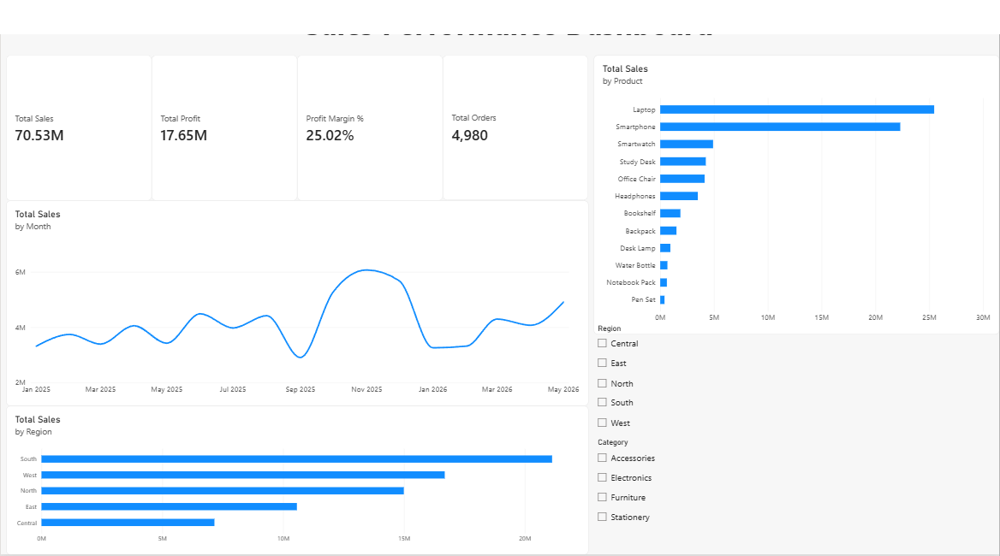

# Sales Data Analysis & Power BI Dashboard



End-to-end sales analysis: raw data → cleaning in Python/Excel → summary analysis in Excel → interactive Power BI dashboard.

> **Data note:** The dataset is **synthetic** (randomly generated, fixed seed) to demonstrate the workflow. It is not real company data.

## Tools
Microsoft Excel · Power BI · Python (pandas, openpyxl) for data generation/cleaning

## Project Structure
```
├── data/
│   ├── raw_sales_data.csv        # messy raw data (5,060 rows)
│   └── cleaned_sales_data.csv    # cleaned data (4,980 rows)
├── excel/
│   └── Sales_Analysis.xlsx       # cleaned data + summary tables, KPIs, charts (formula-driven)
├── powerbi/
│   ├── Sales_Dashboard.pbix      # Power BI dashboard (add after building)
│   ├── DAX_measures.md           # measures used in the dashboard
│   └── dashboard_screenshot.png  # add a screenshot here
└── scripts/
    └── generate_and_clean.py     # reproduces the data, cleaning and Excel report
```

## Data Cleaning Steps
| Issue in raw data | Fix |
|---|---|
| 60 duplicate rows | Removed |
| Two date formats (`YYYY-MM-DD`, `DD/MM/YYYY`) | Standardised to one date type |
| Inconsistent Region text (` south `, `WEST`) | Trimmed, Title Case |
| 20 rows with missing Region | Dropped |
| 20 rows with missing Discount | Filled with 0 |
| No revenue metrics | Added `Sales`, `Cost`, `Profit`, `Month` columns |

## Key Metrics (Jan 2025 – May 2026)
| KPI | Value |
|---|---|
| Total Sales | ₹7.05 Cr (₹70.5 M) |
| Total Profit | ₹1.76 Cr (₹17.6 M) |
| Profit Margin | 25.0% |
| Orders | 4,980 |
| Avg. Order Value | ₹14,162 |

## Insights
1. **Strong seasonality:** Oct–Dec 2025 produced about 24% of all sales in the period; **November 2025** was the peak month (₹6.07 M). Sales then dropped ~43% from Dec to Jan 2026.
2. **Regional performance:** **South** leads with ~30% of sales (₹21.1 M), followed by West (₹16.7 M) and North (₹15.0 M). Central is the smallest region (₹7.2 M) and a growth opportunity. Profit margins are similar across regions (~25%).
3. **Product concentration:** **Laptop and Smartphone together generate ~68% of sales**, and Electronics as a category is ~80%.
4. **Volume vs. margin:** Notebook Packs and Pen Sets sell the most units, and Accessories/Stationery earn ~45% margin versus ~22% for Electronics. High-revenue products are not the highest-margin ones.

## Recommendations
- Plan inventory and marketing campaigns ahead of the Oct–Dec peak; run promotions to offset the January slump.
- Invest in Central region marketing to grow its share.
- Bundle high-margin accessories with laptops/smartphones to lift overall profitability.

## How to Reproduce
```bash
pip install pandas numpy openpyxl
python scripts/generate_and_clean.py
```
Then open `data/cleaned_sales_data.csv` in Power BI and follow `powerbi/DAX_measures.md`.
